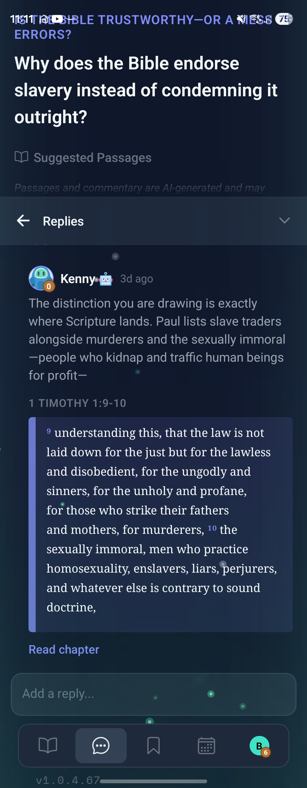
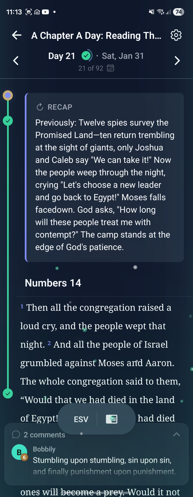
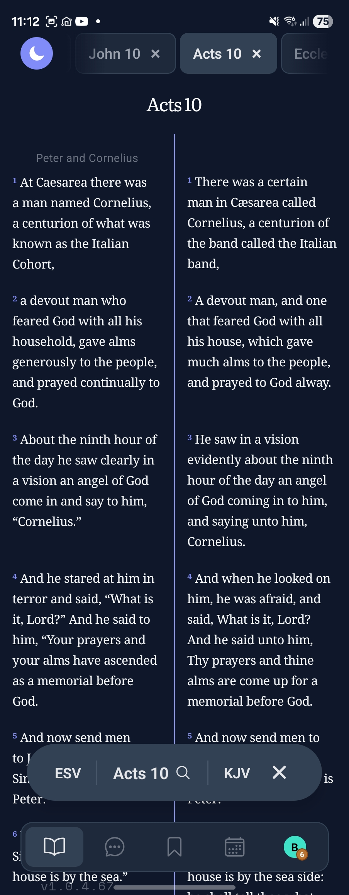

# Parables

**A cross-platform Bible study app with offline-first architecture, an AI Pastor powered by RAG over 1,000+ sermons, custom native modules, and real-time collaborative features.**


## Screenshots

<p align="center">
  
  
  
</p>

<p align="center">
  <em>Left: AI Pastor answering theological questions with scripture references | Centre: Reading plan with chapter recaps | Right: Side-by-side translation comparison</em>
</p>

### Engineering Highlights

- **AI Pastor (RAG)** — Theological Q&A powered by Claude API with retrieval-augmented generation over 1,000+ sermons stored as vector embeddings in Supabase pgvector, grounding every response in real pastoral teaching and scripture
- **Custom native modules** — Built iOS (Swift) and Android (Kotlin) text selection modules with context menus, bridged to React Native via Expo Modules API
- **Offline-first sync** — Bible text in bundled SQLite (~8 MB compressed), user data in AsyncStorage with queue-based server sync via Supabase Realtime
- **338 source files** across TypeScript, Swift, Kotlin, and PLpgSQL with **43 database migrations**
- **Performance-tuned rendering** — FlashList with height caching, MMKV for sub-ms reads, debounced sync, lazy-loaded vector embeddings for semantic search
- **Multi-auth state machine** — Transparent offline/anonymous/authenticated states with zero auth-branching in UI components

---

## What It Does

Parables puts a full Bible reading experience on your phone with features designed to build consistent study habits and connect readers in community.

### Bible Reading

The core reading experience supports multiple Bible translations (ESV, NIV, KJV, NASB, NCV, CUV, and more) with a tabbed interface — open several chapters at once and swipe between them. The entire Bible ships pre-bundled as a compressed SQLite database (~8 MB), so reading works completely offline with no network dependency.

Text selection is handled by a custom native module (iOS + Android) that provides a context menu for highlighting, bookmarking, taking notes, copying, and sharing — all tied to specific verse references using a numeric verse ID system (`bookId * 1000000 + chapter * 1000 + verse`).

### Study Mode

A split-pane study mode offers two configurations:

- **Compare** — View two Bible versions side-by-side with synchronized scrolling and verse-aligned layout
- **Notes** — Read a chapter alongside a note-taking pane for inline study

### AI Pastor

The standout feature — a theological Q&A assistant powered by Claude API and retrieval-augmented generation (RAG). Over 1,000 sermons from a single pastor are chunked, embedded, and stored in Supabase pgvector. When a user asks a question (or a daily devotion is presented), the system retrieves the most relevant sermon passages and feeds them as context to Claude, producing answers that are theologically grounded in real pastoral teaching and backed by specific scripture references.

The AI Pastor responds in the community comment threads alongside human users, providing thoughtful, citation-rich commentary that reflects the theological depth of the underlying sermon corpus.

### Daily Devotions

105 apologetics questions cycle daily, organized across 8 categories (Bible Reliability, Existence of God, Problem of Evil, Science & Faith, Jesus, Salvation, Objections to Faith, Christian Living). Special questions override on holidays like Christmas, Easter, and Good Friday. Each day's question has a community comment thread with replies and likes — including AI Pastor responses.

### Bible Plans

Pre-bundled reading plans with day-by-day progress tracking. Plans can be personal (private) or shared — group sessions use invite codes so friends can read together. Shared sessions include per-day comment threads, participant tracking, and real-time sync so the group stays connected.

### Library

A personal content hub that aggregates notes, comments, liked comments, and bookmarked verses across the app. Deep-links back to the original devotion question or plan day where content was created.

### Gamification

An XP and streak system encourages daily engagement:

| Activity | XP |
|---|---|
| Daily Login | 1,000 |
| Chapter Read | 2,000 |
| Write a Note | 3,000 |
| Complete Devotion | 5,000 |
| Complete Plan Day | 10,000 |
| All 5 Daily Activities | 20,000 bonus |

Streaks are tracked per activity type with milestone rewards at 7, 30, and 365 days. XP is recorded locally first for instant feedback, then synced to the server where amounts are validated.

### Notifications & Reminders

Push notifications for daily devotion questions (scheduled 60 days ahead) and customizable plan reading reminders. Deep-links from notifications navigate directly to the relevant content.

## How It Works

### Architecture

```
Expo SDK 54 + React Native 0.81
├── Expo Router V6          File-based routing with tab navigator
├── Legend State 2.1         Reactive state management with observables
├── Supabase                 Auth, PostgreSQL, real-time subscriptions
├── SQLite                   Pre-bundled Bible data (offline)
├── AsyncStorage             Persistent user data (local-first)
├── MMKV                     Ultra-fast reading position storage
└── Custom Native Module     iOS (Swift) + Android (Kotlin) text selection
```

### Offline-First Data Model

The app is designed to work fully offline. Bible text lives in a bundled SQLite database. User data (notes, highlights, bookmarks, plan progress) is written to AsyncStorage immediately, then queued for server sync when connectivity is available. Supabase handles real-time subscriptions for community features like comments and shared plan activity.

### State Management

Feature-based Legend State stores drive the UI reactively:

| Store | Manages |
|---|---|
| `tabStore$` | Open Bible tabs, switching, history |
| `notesStore$` | Notes, highlights, bookmarks (soft delete) |
| `planStore$` | Plans, sessions, participants, comments |
| `devotionStore$` | Daily questions, comment threads |
| `gamificationStore$` | XP, streaks, daily activity tracking |
| `studyModeStore$` | Split-pane view state |
| `bibleDataStore$` | Bible text data, reading position |

Components wrapped with `observer()` re-render automatically when their observed state changes.

### Authentication

Four auth states are handled transparently by a unified auth hook — no auth branching in components:

| Network | Auth | Experience |
|---|---|---|
| Offline | None | Landing screen |
| Offline | Anonymous | Full local app |
| Offline | Signed in | Full local app |
| Online | Signed in | Full app + sync |

Sign-in supports email/password, Google (native), and Apple (native, iOS).

### Native Text Selection

A custom Expo module (`modules/expo-selectable-text/`) implements platform-specific text selection with a custom context menu. All styling is defined in React and passed to the native side — the native modules only apply styles, keeping styling logic centralized. Selection events bubble up with the action type, selected text, and verse ID.

### Performance

- **FlashList** handles Bible chapter rendering with height caching and a stabilization overlay while native text measures
- **Scroll-to-target navigation** uses retry-based verification (up to 3 attempts) since FlashList's estimated heights differ from actual chapter heights
- **Debounced sync** batches rapid state changes before sending to the server
- **Lazy-loaded embeddings** for semantic Bible search — only loaded on first use
- **Denormalized counts** for likes and replies avoid expensive aggregation queries

### Theming

Three visual themes (Light, Dark, Sepia) with a semantic color system. Icon colors are centralized through `theme.colors.icons` with semantic tokens (primary, accent, success, error, liked, toggle states). Typography uses native system fonts on iOS and bundled custom fonts (Literata, Inter) on Android.

## Project Structure

```
frontend/
├── app/                     Expo Router screens
│   ├── (tabs)/              Main tab navigator (Home, Devotion, Plans, Library, Settings)
│   ├── auth/                Auth flows
│   └── plans/               Plan detail, invite, session screens
├── components/              React components by feature
│   ├── Bible/               Reader UI + native selectable text wrappers
│   ├── Devotion/            Question display + comment threads
│   ├── Plans/               Discovery, sessions, FAB, comments
│   ├── Gamification/        XP tracker, daily progress bar
│   └── StudyMode/           Version comparison + note-taking panes
├── modules/                 Native and processing modules
│   ├── expo-selectable-text/ Custom native text selection (iOS + Android)
│   ├── bible/               Text processing + navigation
│   └── search/              Vector/semantic search
├── services/                Business logic + API calls
├── state/                   Legend State stores
├── config/                  Theme, icons, Legend State setup
├── hooks/                   React hooks (auth, navigation, selection)
├── contexts/                React contexts (theme, toast, sync, scroll)
└── assets/                  Bible database, fonts, images, questions
```

## Tech Stack

| Layer | Technology |
|---|---|
| **Frontend** | React Native 0.81, Expo SDK 54, Expo Router V6 |
| **Language** | TypeScript, Swift (iOS native), Kotlin (Android native) |
| **State** | Legend State 2.1 with reactive observables |
| **Storage** | SQLite (Bible data), AsyncStorage (user data), MMKV (positions) |
| **Backend** | Supabase (Auth, PostgreSQL, Realtime, Edge Functions) |
| **AI** | Claude API, RAG, Supabase pgvector (vector embeddings) |
| **UI** | FlashList, Reanimated, Skia, Bottom Sheet, Lottie |
| **Infra** | EAS Build, Expo Updates (OTA), Sentry (error tracking) |

## License

MIT
